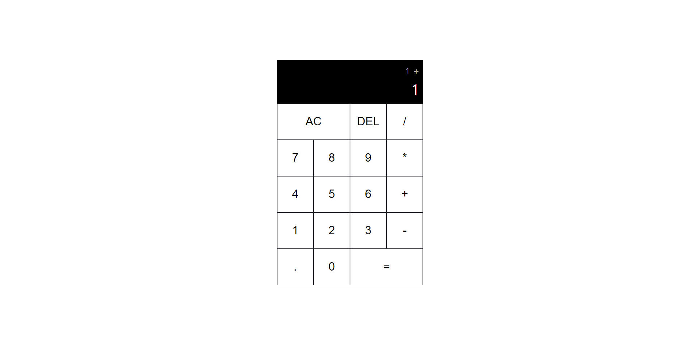
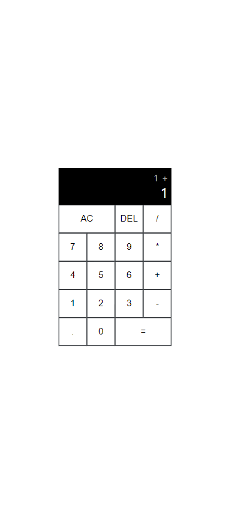

# Mini Calculator

Minimal calculator application.
 
Please take a moment to try this web application [here](https://mini-calculator-beta.vercel.app/).

## How to Use

This web application has the same behavior as other calculators.

Press the button to append number, choose operation, calculate, delete one character, or clear all.

## Skills

- Javascript (ES6)
- Node JS
- CSS
- HTML

## Display Examples

### Desktop Display

### Galaxy S20 Ultra Display (412 x 915)

## Acknowledgement

This web application is developed using Vite environment.
 
This web application is deployed on [vercel](https://mini-calculator-beta.vercel.app/).
 
The copyright of [Favicon](https://fonts.google.com/icons?selected=Material+Symbols+Outlined:calculate:FILL@0;wght@400;GRAD@0;opsz@24&icon.query=calculator) used in this web application belongs to Google.

## Contact Info

- Name: Yeseong Kim
- Personal Email: mryesung1@gmail.com
- Public Email: yeseonk@uci.edu
- Phone: (+1) 949-836-1299

## Takeaways

- Developed a JavaScript class adhering strictly to the Single Responsibility Principle in Object-Oriented Programming.
- Gained proficiency in enhancing code architecture by segregating HTML attributes for CSS into class attributes, while effectively employing ids and data attributes for JavaScript, resulting in improved code organization and readability.
